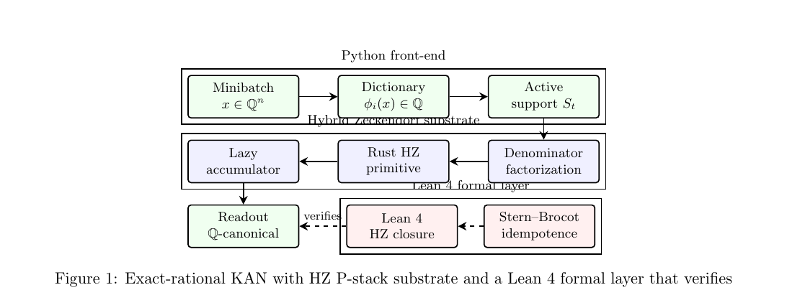
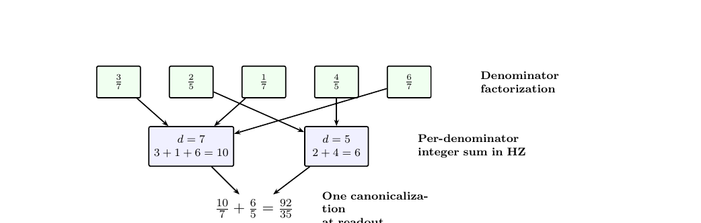

# Rational KAN HZ

**Exact-Rational Kolmogorov–Arnold Networks with Hybrid Zeckendorf Arithmetic, Lean 4 Formal Verification, and Reproducible Benchmark Artifacts.**

[](LICENSE.md)
[](https://leanprover.github.io/)
[](https://www.python.org/)
[](https://www.rust-lang.org/)
[](#quickstart)
[](results/PAPER_RUN_REPORT.md)

Train a Kolmogorov–Arnold Network whose weights live in $\mathbb{Q}$ rather than in IEEE 754, run its forward/backward/update loop through a **Rust Hybrid Zeckendorf** P-stack that is **bit-identical** to a Python `fractions.Fraction` oracle, and extract the symbolic closed form of the trained model without any heuristic rationalization step. The formal algebraic substrate and the projection lemma driving symbolic extraction are mechanized in **Lean 4** in a vendored 113-module subset of the HeytingLean library.

---

## TL;DR

| | |
|---|---|
| **Bit-identical parity** at degree 8, width 10 (forward/backward/update) | ✅ proved |
| **Sparse-dictionary training speedup at $10^{7}$ features** | **44.17×** (95% CI [42.59, 45.41]) |
| **GPU training speedup** (dense → P4, sparse-active, $10^{6}$ features) | **3.73×** (95% CI [3.68, 3.77]) |
| **Memory footprint** (P4 / dense, $10^{6}+$ features) | **0.418** |
| **Formal Lean 4 core** | 113 modules + 1 umbrella file, `lake build` clean |
| **Narrow-network inference speed** | honestly **open**, tracked as a separate conjecture |

---

## Paper

**Exact-Rational Kolmogorov–Arnold Networks with Hybrid Zeckendorf Arithmetic: Bit-Identical Training, Denominator-Factored Lazy Accumulation, and Formal Verification in Lean 4**
*Apoth3osis Labs; Richard Goodman; Vladimir Veselov. April 2026.*

- **[Paper PDF](papers/rational_kan_hz/rational_kan_hz_paper.pdf)** — 11 pages
- [LaTeX source](papers/rational_kan_hz/rational_kan_hz_paper.tex)
- [Convergence theorem (standalone)](papers/rational_kan_hz/theorem_convergence.tex)

Rebuild (TeX Live 2023+):

```bash
cd papers/rational_kan_hz
pdflatex rational_kan_hz_paper.tex && pdflatex rational_kan_hz_paper.tex
```

---

## Architecture

<p align="center"></p>

The Python front-end produces exact-rational dictionary evaluations and the active support. The Hybrid Zeckendorf substrate performs denominator-factored lazy accumulation inside a Rust primitive, canonicalizing only at readout. A Lean 4 formal layer verifies the underlying arithmetic closure and supplies the Stern–Brocot projection idempotence lemma consumed by the symbolic-extraction convergence theorem.

### The FactoredRationalLazyAccumulator

<p align="center"></p>

Heterogeneous rational summands are **split by denominator**, summed as **pure integers** inside the Rust HZ primitive, and recombined with a single canonicalization at readout time — preserving bitwise equality with Python `Fraction` while routing the arithmetic through a typed, closure-verified kernel.

---

## What Is This?

The repository isolates the exact surfaces needed to study three linked questions:

1. **Can** a rational KAN be trained and symbolically exported without losing exactness?
2. **When** does the Hybrid Zeckendorf P-stack preserve bit-identical semantics against a `fractions.Fraction` oracle?
3. **Where** does sparse-active large-dictionary training actually gain speed, and where does it not?

Answers (short form, with full evidence in the paper):

1. **Yes**, at degree 8 hidden width 10 the parity log is exact on every tensor, every step.
2. **Always**, by construction — the denominator-factored dispatch is an algebraic identity.
3. At dictionary sizes $m \geq 10^{6}$ under sparse-active support; **not** on narrow dense rational KANs, where 99.28% of P-stack wall time is consumed inside the HZ primitive itself (no bridge engineering remains that could close the gate).

---

## Key Results

Sparse-active large-dictionary training (batch size 65 536, 1 000 steps, 30 seeds per cell; `dense_over_p4` ratio):

| Features $m$ | Mean speedup | 95% CI | Memory ratio $p_4/\mathrm{dense}$ |
|---:|---:|:---:|---:|
| $10^{4}$ | 1.17 | [1.16, 1.17] | 0.991 |
| $10^{5}$ | 1.17 | [1.16, 1.17] | 0.918 |
| $10^{6}$ | 3.33 | [3.23, 3.40] | 0.418 |
| $10^{7}$ | **44.17** | **[42.59, 45.41]** | **0.418** |

Log–log exponent of speedup vs. feature count: $\alpha = 0.519 \pm 0.178$ (SE).

All machine-readable summaries live in `artifacts/rational_kan_hz/paper_run/`, each carrying a commit hash, host CPU, platform, and thermal state at run time.

---

## Quickstart

Clone, install, verify everything:

```bash
git clone https://github.com/Abraxas1010/rational-kan-hz.git
cd rational-kan-hz
python3 -m venv .venv && source .venv/bin/activate
python3 -m pip install -e .
./scripts/verify_all.sh
```

`verify_all.sh` runs the full chain:

1. `cargo build --release --bin pstack_exact_accumulate` — Rust Hybrid Zeckendorf backend
2. `pytest tests/` — the complete regression suite (27 tests: parity, symbolic extraction, confluence, bit-reproducibility, GPU scaling, paper-run orchestration)
3. `lake build` — Lean 4 formal subset (3 209 build jobs)
4. `scripts/verify_results.py` — asserts the scaling, parity, and GPU gates from the packaged summary JSONs

Individual lanes:

```bash
make verify-rust       # Rust P-stack backend
make verify-python     # 27 pytest regressions
make verify-lean       # lake build (~3 min with Mathlib cache)
make verify-results    # scripts/verify_results.py gate assertions
```

> **First-time Lean setup:** run `lake update` once to fetch Mathlib v4.24.0 (≈400 MB cache download). Subsequent `lake build` invocations are incremental.

---

## Repository Layout

| Path | Contents |
|---|---|
| [`src/rkan_hz/`](src/rkan_hz/) | Exact-rational RKAN, symbolic extraction, paper-run orchestration, in-loop P-stack parity lane, GPU scaled sparse-training lane |
| [`bench/hybrid_zeckendorf/`](bench/hybrid_zeckendorf/) | Rust source for the Hybrid Zeckendorf backend and `pstack_exact_accumulate` persistent worker |
| [`lean/`](lean/) | 113-module Lean 4 subset: HZ arithmetic closure, Zeckendorf canonicality surface, Stern–Brocot idempotence, sanity tests |
| [`tests/`](tests/) | Full project regression suite |
| [`artifacts/rational_kan_hz/`](artifacts/rational_kan_hz/) | Packaged benchmark and symbolic-export outputs used in the paper |
| [`conjectures/`](conjectures/), [`Blueprint/proof_trees/`](Blueprint/proof_trees/) | Research ledger: proved vs. open claims with evidence floors |
| [`papers/rational_kan_hz/`](papers/rational_kan_hz/) | Paper sources (LaTeX) and compiled PDF |
| [`results/`](results/), [`docs/`](docs/) | Human-readable reports and scope documents |

---

## Formal Verification Boundary

The Lean package formalizes the **algebraic substrate** and the **projection lemma** consumed by the symbolic-extraction convergence theorem. It does *not* claim that every empirical Python or CUDA benchmark number is mechanized in Lean.

**Lean side (mechanized):**
- Hybrid Zeckendorf arithmetic structure and closure identities (`basePhiEval_add`, `basePhiEval_mul`, `basePhiEval_rawBasePhiMul`)
- Zeckendorf canonicality surface (`HeytingLean.Boundary.Homomorphic.ZeckendorfCanonical`)
- Stern–Brocot projection idempotence (`HeytingLean.SternBrocot.stern_brocot_idempotent_on_bounded`)
- Sanity tests binding the Lean surface to explicit evaluation

**Python / Rust side (executable evidence):**
- Exact-rational RKAN training, symbolic extraction, LaTeX roundtrip
- Rust Hybrid Zeckendorf primitive and bridge
- Empirical speed, memory, and bit-reproducibility characterization

The split is deliberate. See [`docs/FORMALIZATION_SCOPE.md`](docs/FORMALIZATION_SCOPE.md) and [`docs/RESULTS_INDEX.md`](docs/RESULTS_INDEX.md).

---

## Scope Split: Parity + Scale Proved, Speed Regime Open

On 2026-04-20 an interior self-audit flagged that bundling *parity*, *scale*, and *narrow-network inference speed* into a single conjecture was a Name–Content Drift: the name implied what was intended, not what was delivered. The conjecture was split:

| Conjecture | Status | What it claims |
|---|---|---|
| `rational_kan_hz_pstack_in_loop_20260420` | **proved** | HZ P-stack runs the exact-rational KAN forward/backward/training loop with bit-identical Fraction semantics at degree 8 hidden width 10 |
| `rational_kan_hz_pstack_speed_regime_20260420` | **open (partial)** | There exists a regime (microbatch $m^{\ast}$, width $w^{\ast}$, or workload class) on the narrow-network substrate where HZ achieves CI95 lower > 1.0 vs. GMP-backed Fraction |

The speed-regime conjecture carries a concrete evidence floor:

- Microbatch sweep $m \in \{1,4,8,16,32,64,128\}$: monotone improvement from 0.021× to 0.081×, no crossover at $m \leq 128$
- Width sweep $w \in \{10,50,200,500\}$: monotone decrease, $2.80 \times 10^{-3}$ down to $6.38 \times 10^{-5}$
- Bridge-overhead breakdown: **99.28 %** of P-stack wall time is inside the Rust HZ primitive itself — at most 0.72 % remains available to bridge IO engineering

The large-dictionary speed regime (the 44.17× at $10^{7}$ features) crosses the gate **independently** under a different workload class; the remaining open question is whether any narrow-network regime crosses it at all.

---

## Citation

If you use this repository, please cite both the paper and the software artifact:

**BibTeX**

```bibtex
@misc{apoth3osis_rkan_hz_2026,
  author       = {{Apoth3osis Labs} and Goodman, Richard and Veselov, Vladimir},
  title        = {Exact-Rational Kolmogorov--Arnold Networks with Hybrid
                  Zeckendorf Arithmetic: Bit-Identical Training,
                  Denominator-Factored Lazy Accumulation, and Formal
                  Verification in Lean~4},
  year         = {2026},
  howpublished = {Apoth3osis Labs companion repository},
  url          = {https://github.com/Abraxas1010/rational-kan-hz}
}
```

Machine-readable metadata: [`CITATION.cff`](CITATION.cff).

---

## License

[**Apoth3osis License Stack v1**](LICENSE.md) — a tri-license:

- **CPGL (Public Good)** — free when you publish your derivative software under an OSI-approved license and your associated research open access.
- **CSBL (Small Business)** — free for organizations below the revenue, workforce, and external-financing thresholds spelled out in [`licenses/Apoth3osis-Small-Business-License-1.0.md`](licenses/Apoth3osis-Small-Business-License-1.0.md).
- **CECL (Enterprise Commercial)** — required for all other uses; includes rights to the *Apoth3osis-Certified* mark and attestation bundle.

See [`LICENSE.md`](LICENSE.md) and the files under [`licenses/`](licenses/) for the complete terms.

---

<sub>
<strong>Acknowledgment.</strong>
We humbly thank the collective intelligence of humanity for the prior work on which this repository builds. Formalization in Lean 4 rests on the Mathlib community's cumulative effort; exact rational arithmetic rests on the GMP project; the Hybrid Zeckendorf structure rests on Zeckendorf's 1972 representation theorem and a long tradition of Fibonacci-ratio analysis. Our contribution is merely the next link in an unbroken chain of human ingenuity.
</sub>
